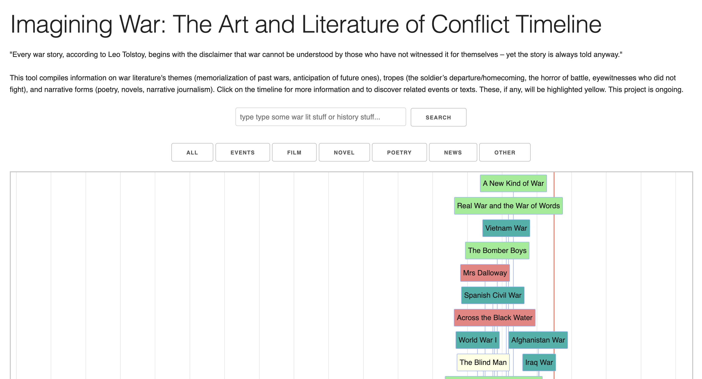
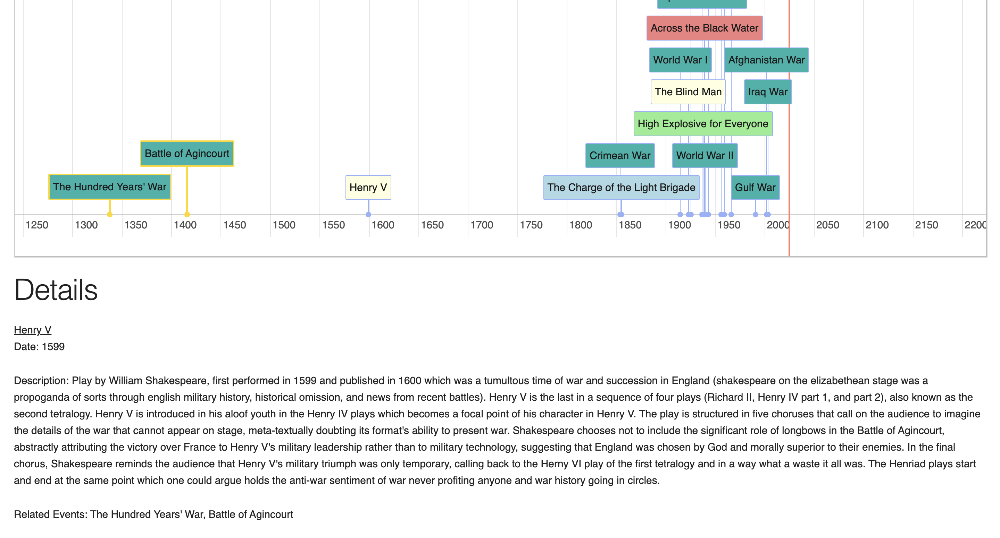

# warlit
Plots war literature and war events on a timeline. Highlights relationships between literature and events.

Try it out [here!](https://cj-hines.github.io/warlit)

## Notes
A tool developed by CJ Hines for the course *Imagining War: The Art and Literature of Conflict* at the Pembroke Cambridge Summer Programme.
